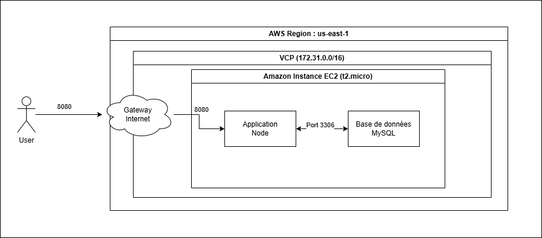

# Phase 1

## Infrastructure
Ici le déploiement est automatisé via Terraform d'une instance Amazon EC2 Ubuntu de type t2.micro. Dans cette partie, l'instance héberge une application Express (Node.js) et une base de donnée MySql (port 3306).

## EC2 

L'instance héberge à la fois le serveur web (Node.js) et la base de données (MySQL). Les deux communiquent localement sur le port 3306.

## Accès 

L'application est exposée sur Internet via le port 80 (HTTP), géré par un Security Group qui permet de sécurisé les flux entrants et sortant. Pour notre exemple on a laissé ouvert pour que cela soit plus simple (limitation du réseau de l'école).

## Etapes de la phase 1

Voici les étapes structurées pour mettre en place cette infrastructure et déployer l'application, de la configuration initiale au test final :

### 1. Préparation de l'Environnement Terraform
- **Initialisation du projet** : Création d'un répertoire de travail et des fichiers `.tf` (providers, instances, security groups).
- **Configuration du Provider** : Définition d'AWS comme fournisseur avec la région `us-east-1`.
- **Sélection de l'AMI** : Utilisation d'un filtre `data` pour récupérer automatiquement la dernière image **Ubuntu 22.04 LTS** officielle.

### 2. Configuration Réseau et Sécurité
- **Ciblage du réseau** : Récupération du **VPC par défaut** du compte AWS pour simplifier le routage.
- **Définition du Security Group** :
  - Ouverture du port **80 (HTTP)** pour autoriser le trafic web public.
  - Ouverture du port **3306 (MySQL)** pour les flux internes au VPC.
  - Autorisation de tous les flux sortants (Egress) pour permettre le téléchargement des dépendances.

### 3. Déploiement de l'Instance EC2
- **Instance** : Création de l'instance de type **t2.micro** avec attribution d'une IP publique.
- **Injection du script User Data** : Liaison du fichier `UserdataScript-phase-2.sh` qui s'exécutera automatiquement au premier démarrage.

### 4. Validation
- **Récupération de l'URL** : Utilisation de la variable `output "public_ip"` de Terraform qui permet d'obtenir l'adresse de l'instance.
- **Test** : Accès via un navigateur pour vérifier l'affichage de la liste des étudiants et tester les opérations CRUD.